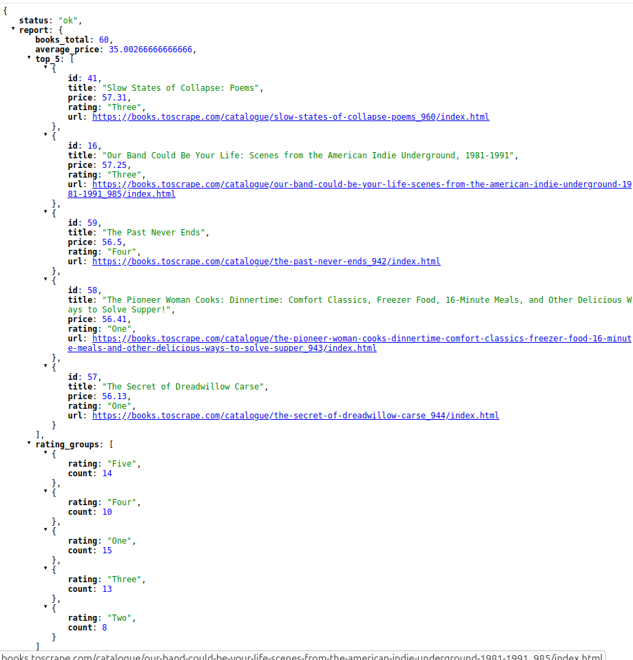
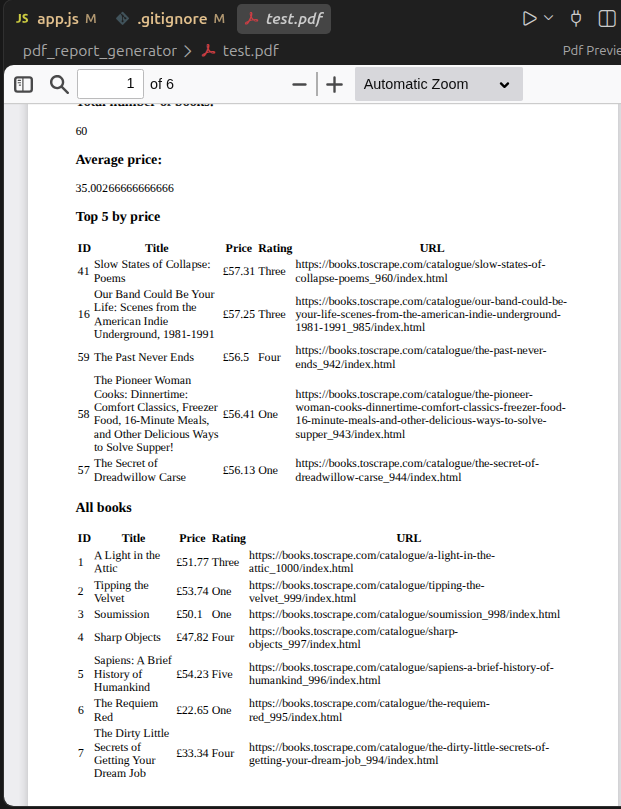

# pdf_report_generator

By using small requests the main job is done in less period of tim for user.
Using idempotency helps to avoid additional work, email resending, report generstion on the same date, reasking for web pages in db.

# Curls

 time curl -i -X POST http://localhost:8000/reports
HTTP/1.1 201 Created
X-Powered-By: Express
Content-Type: application/json; charset=utf-8
Content-Length: 63
ETag: W/"3f-KxtBtUTcGj6gJur5CKJkpFhSUJ8"
Date: Thu, 27 Aug 2026 20:17:51 GMT
Connection: keep-alive
Keep-Alive: timeout=5

{"id":1,"file":"reports/1787861871029.pdf","message":"Created"}
real    0m0.721s
user    0m0.007s
sys     0m0.008s

curl -i http://localhost:8000/reports/1
HTTP/1.1 200 OK
X-Powered-By: Express
Content-Type: application/json; charset=utf-8
Content-Length: 36
ETag: W/"24-DN7K9dagJcw7Ruw3sxLliuQki/g"
Date: Thu, 27 Aug 2026 20:18:31 GMT
Connection: keep-alive
Keep-Alive: timeout=5

{"link":"reports/1787861871029.pdf"}

 curl -i http://localhost:8000/reports/3
HTTP/1.1 404 Not Found
X-Powered-By: Express
Content-Type: application/json; charset=utf-8
Content-Length: 26
ETag: W/"1a-0YAItIJ1shWF2zRflWw3Pgww6aU"
Date: Thu, 27 Aug 2026 20:19:20 GMT
Connection: keep-alive
Keep-Alive: timeout=5

{"message":"FileNotFound"}